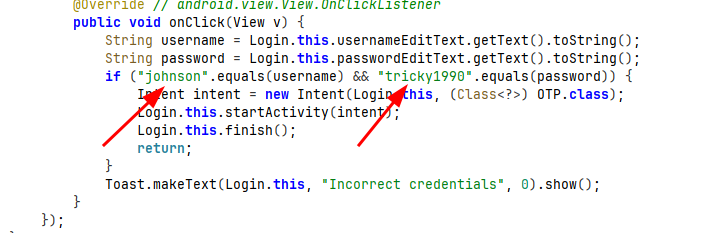
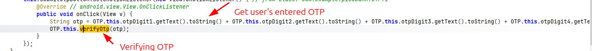
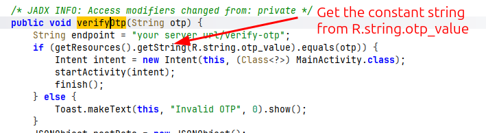
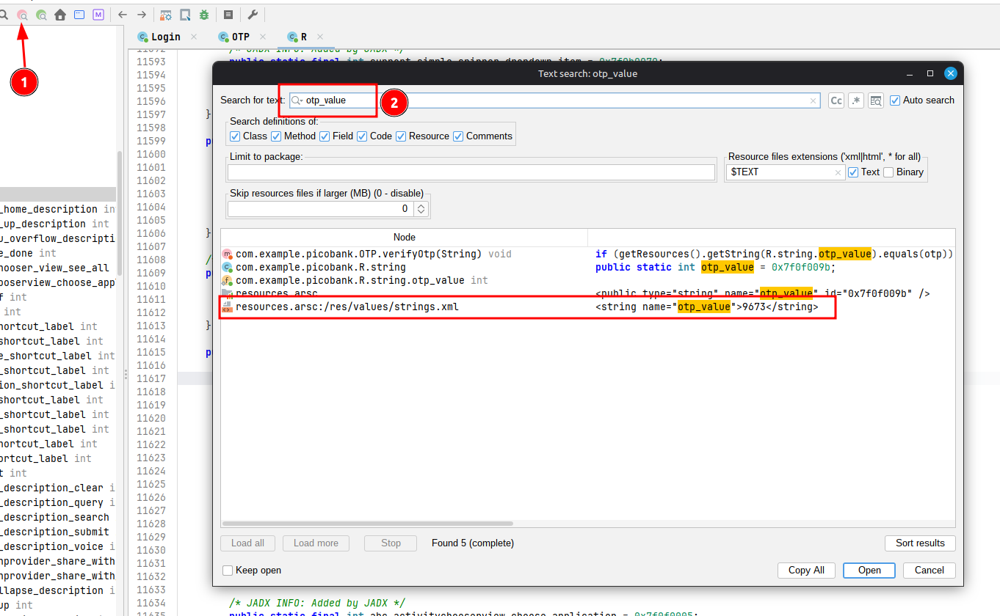
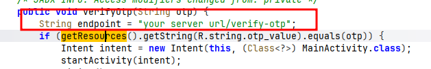

# **Reverse Engineer**

1. Download the apk file from the website.

2. Open JADX and drop the apk file into JADX.

3. in com.example.picobank, there is a Login function that include the hard coded username and password
   

4. Once login, it will request an OTP. We can find the ```OTP()``` method  by browsing in the same directory as the ```Login``` class.
   

5. There is a function that check for OTP when user submit it.


Searching the verifyOtp will reveal more about how the program verify the OTP


6. Search ```otp_value``` within the whole project will reveal the OTP number.


7. Now, get back to the ```OTP()``` method. There is a string "endpoint" which point to the web server route.


8. By using BurpSuite or any other tools, send a request to the website ```/verify-otp``` endpoint with the header "Content-Type:application/json" and body of 
```
{
    "otp":"9673"
}
```
will reveal the 2nd part of the flag.

9. The notification in the Pico Bank application give us hint that there is something wrong with the transaction value. All the transaction are in binary format. Convert it to decimal and based on the decimal value, find the corresponding ascii will reveal the 1st part of the flag.

